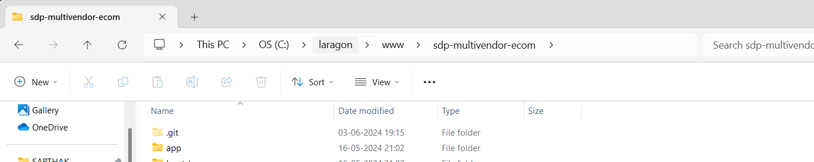
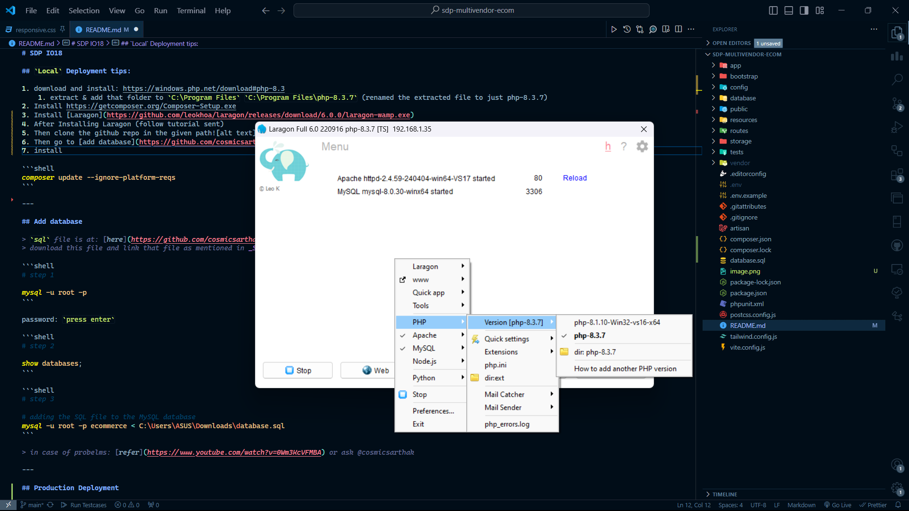
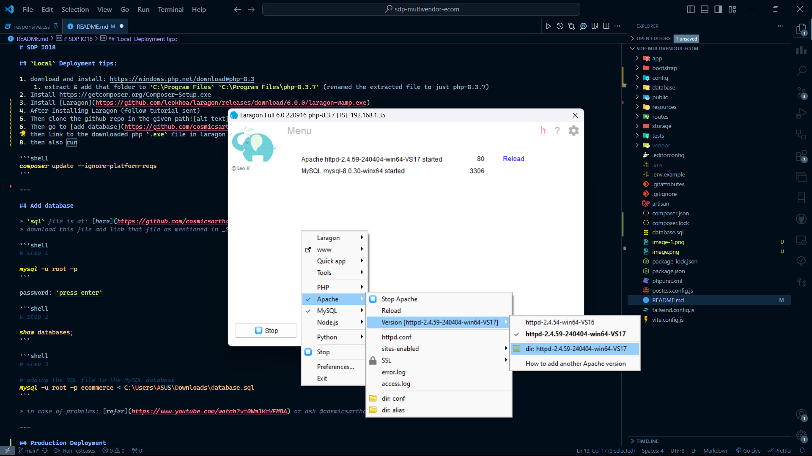

# SDP IO18

## `Local` Deployment tips:

1. download and install: https://windows.php.net/download#php-8.3
    1. extract & add that folder to `C:\Program Files` `C:\Program Files\php-8.3.7` (renamed the extracted file to just php-8.3.7)
2. Install https://getcomposer.org/Composer-Setup.exe
3. Install [Laragon](https://github.com/leokhoa/laragon/releases/download/6.0.0/laragon-wamp.exe)
4. After Installing Laragon (follow tutorial sent)
5. Then clone the github repo in the given path
6. Then go to [add database](https://github.com/cosmicsarthak/sdp-IO18_multivendor/blob/main/README.md#add-database)
7. then link to the downloaded php `.exe` file in laragon like this... 
8. then also add the Apache folder from here as shown. (folder sent on Whatsapp) 

```shell
composer update --ignore-platform-reqs
```

---

## Add database

> `sql` file is at: [here](https://github.com/cosmicsarthak/sdp-IO18_multivendor/blob/main/database.sql)
> download this file and link that file as mentioned in _Step-3_ command below to **upload to mySQL database**.

```shell
# step 1

mysql -u root -p
```

password: `press enter`

```shell
# step 2

show databases;
```

```shell
# step 3

# adding the SQL file to the MySQL database
mysql -u root -p ecommerce < C:\Users\ASUS\Downloads\database.sql
```

> in case of probelms: [refer](https://www.youtube.com/watch?v=0Wm3KcVFMBA) or ask @cosmicsarthak

---

## Production Deployment

-   https://youtu.be/kG8RP6Rk0K8?si=zrclv7haFzHnZPW4
-   https://youtu.be/kstcGqmzow8?si=eBM337XfxSwQOa6r `digital ocean`

---

## Known errors:

```
Fatal error: Composer detected issues in your platform: Your Composer dependencies require a PHP version ">= 8.2.0". You are running 8.1.10. in C:\laragon\www\sdp-multivendor-ecom\vendor\composer\platform_check.php on line 24
```

### Fixes:

-   https://github.com/leokhoa/laragon/issues/600#issuecomment-1881062927
-   https://github.com/leokhoa/laragon/issues/600#issuecomment-1993504755
